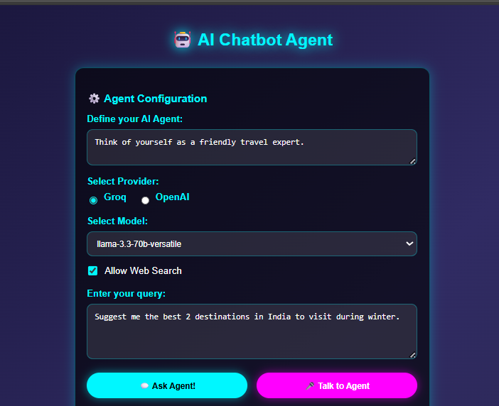
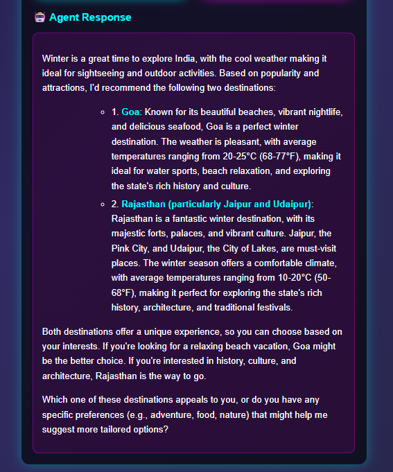
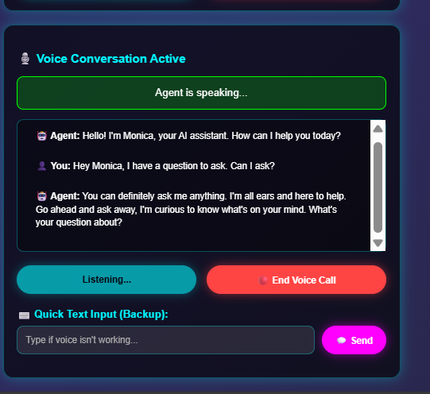

# Monica AI

Monica AI is a powerful web-based conversational AI assistant designed to provide seamless voice and text interactions. It leverages multiple AI models to deliver accurate, intelligent, and dynamic responses, making your conversations smarter and more natural.

---

## Features

### 🎤 Voice Interaction
- **Real-time Speech-to-Text**: Speak naturally, Monica understands instantly  
- **Text-to-Speech Output**: Monica responds with voice in real-time  
- **Continuous Conversations**: Maintains context across multiple exchanges  
- **Smart Voice Detection**: Accurate recognition with error handling  

### 💬 Text Communication
- **Rich Formatting**: Supports markdown, code blocks, and structured responses  
- **Interactive Chat**: Fast, responsive, and real-time text-based conversations  
- **Quick Input**: Type messages even during voice sessions  
- **Conversation History**: Easily track and revisit past chats  

### 🧠 Multi-Provider AI
- **Groq Models**: Llama 3.3 70B, Mixtral 8x7B 32K  
- **OpenAI Models**: GPT-4 Omni Mini  
- **Flexible Choice**: Select the best model for your task  

### ⚡ Advanced Capabilities
- **Web Search Integration**: Fetch real-time information from the internet  
- **Custom System Prompts**: Personalize Monica’s personality and behavior  
- **Responsive Design**: Optimized for both desktop and mobile  
- **Browser Compatibility**: Works across all modern browsers  

---

## How Monica Works
1. **Voice Mode**: Click “Talk to Agent”, speak naturally, and Monica responds in real-time.  
2. **Text Mode**: Type messages, select AI provider and model, and get structured answers.  
3. **Dynamic Conversations**: Switch seamlessly between voice and text while maintaining context.  

---

## Why Monica AI
- Intelligent conversational assistant combining voice and text  
- Multi-model AI support for versatile performance  
- Real-time responses for an interactive experience  
- Fully browser-based with no heavy software required  

---
## Screenshots

### Query Interface

### Query Result

### Voice Interface

## Technology Stack
- **Frontend**: JavaScript, HTML5, CSS3  
- **Speech Processing**: Web Speech API for recognition and synthesis  
- **AI Integration**: REST API communication with Groq and OpenAI  
- **Real-time Features**: Dynamic UI updates and conversation management  

---

## Author
**Varsha Shetty**
